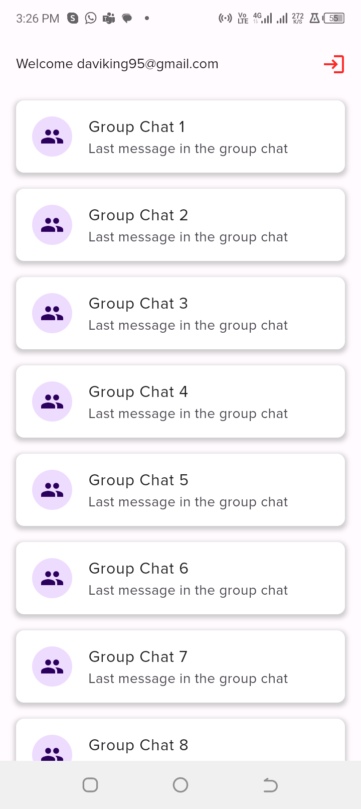
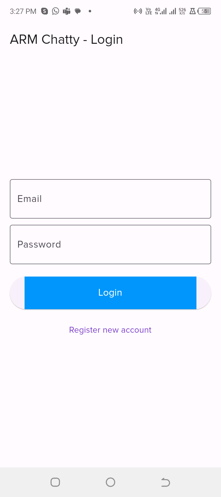
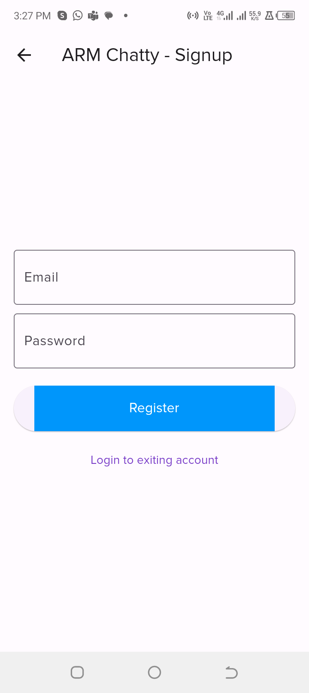

- Instruction: How To Use
  - Create a Flutter project on your machine
  - Delete all files and folder inside your lib folder in your project
  - Copy all the files and folders above and place them in your lib folder
  - Run your app

1. How long did you spend on the coding test?
    - It took about 8 hours to complete this coding test, although I couldn't add the group chat feature

2. What would you add to your solution if you had more time?
   - I would probably use another platform like Stream.io to handle the group chat feature on the app

3. How would you track down a performance issue in production? Have you ever had to do
   this?
   - I use platforms like Sentry to help me monitor not just performance but also alert me for bugs that can come up while using the app

4. What improvement would you suggest to the Firebase team if you had the chance?
   - Improved SDK to easily create chats and group chats just like Stream.io

- Screenshots

